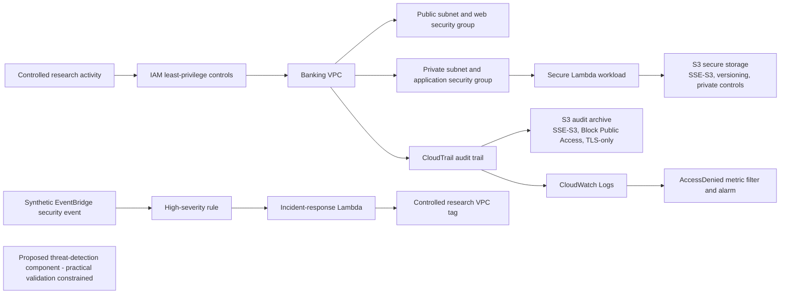

# Implemented Cloud-Banking Security Architecture

## Architecture Overview

The practically validated prototype is a layered AWS security architecture covering network segmentation, least-privilege IAM, protected S3 storage, private Lambda execution, CloudTrail and CloudWatch monitoring, a proposed but constrained GuardDuty capability, and synthetic EventBridge/Lambda incident response.

## Implemented Security Layers

- Network Security
- Identity and Access Management
- Data Protection
- Secure Compute
- Logging and Monitoring
- Automated Incident Response
- Threat Detection as a proposed component with constrained practical validation

## Network Architecture

The network foundation provides an Amazon VPC with public and private subnets. The network-security layer adds separate routing, an Internet Gateway path for the public subnet, private-subnet isolation from a direct Internet Gateway route, and security-group boundaries. The precise final AWS status values were not supplied for this Module 10 review; the documented implementation and earlier validation evidence are used without inferring additional final-state observations.

## Identity and Access Management

The IAM layer uses least-privilege policies and restricted test identities. The documented validation showed that unauthorised privileged activity was denied. The temporary monitoring test identity was subsequently deleted using the authorised administrative identity. The existing IAM documentation records earlier MFA validation for `msc-cloud-admin`; no additional MFA result is inferred here.

## Data Protection

The secure-storage layer uses S3 SSE-S3 AES-256 encryption, Block Public Access, `BucketOwnerEnforced` ownership, versioning, and a TLS-only bucket policy. Validation used synthetic or simulated banking data and did not test real customer data.

## Secure Compute

The secure-compute layer uses an AWS Lambda workload placed within the intended private AWS security boundary and associated with the private application security group. Controlled synthetic execution and CloudWatch evidence were validated.

## Logging and Monitoring

CloudTrail delivers management audit activity to an encrypted S3 audit archive and CloudWatch Logs. The AccessDenied metric filter and alarm demonstrated alert generation, but the complete denied-event CloudTrail/CloudWatch evidence chain was not independently demonstrated.

## Threat Detection

GuardDuty was a proposed threat-detection component. Practical activation and sample-finding validation were constrained by the experimental account and free-plan/service-access limitation. It is not shown as an operational validated service in this architecture.

## Automated Incident Response

EventBridge matches qualifying high-severity synthetic events and invokes Lambda. The validated high-severity response applied `IncidentStatus = Quarantined-Test` and the configured synthetic incident-source tag. This was a controlled research tagging operation, not production network isolation or a real cyberattack.

## Defence-in-Depth Relationships

- IAM restricts who can perform actions.
- Network security restricts communication paths.
- Data protection protects stored information.
- Secure compute provides controlled workload execution.
- Monitoring provides visibility into unauthorised activity.
- Threat detection represents the proposed higher-level finding capability, although practical GuardDuty validation was constrained.
- Incident response automatically responds to qualifying synthetic events.

## Implementation Constraints

### Resource-State Legend

- **A — Currently retained/live during final validation:** The network foundation was retained temporarily for final architecture validation. Exact final AWS status values were not supplied in the Module 10 request.
- **B — Experimentally validated but subsequently removed:** The temporary monitoring test identity was deleted after validation. This category does not claim deletion of other resources where the existing evidence does not confirm it.
- **C — Proposed but not practically validated:** GuardDuty was proposed, but activation and sample-finding validation were constrained by account and service-access limitations.

The prototype uses a single AWS account and Region, limited experimental scale, synthetic or simulated data, and no production banking workload. The diagram shows only implemented or validated controls; GuardDuty is listed as proposed and constrained rather than operational.
